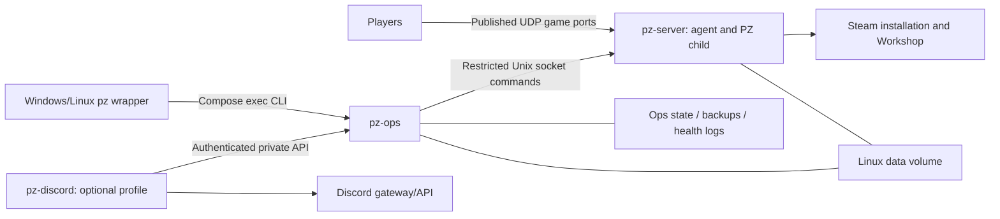

# Proposed portable architecture

Status: phase-1 design, 2026-10-02. No Compose project, image, runtime import or live test has been implemented. Current behavior is documented separately in [CURRENT-SYSTEM.md](CURRENT-SYSTEM.md). Decisions below are proposed defaults, with remaining proof requirements in [../PLAN.md](../PLAN.md).

## Services and control boundary

Use three long-running Linux services, plus one-shot import/restore tooling. The server service needs a small Python process-control agent: separating ops from the game otherwise makes process ownership, signals, UDP inspection and SteamCMD execution difficult without giving ops host Docker access. Do not mount the Docker socket or require privileged containers.

| Service | Responsibilities and access |
| --- | --- |
| `pz-server` | Linux SteamCMD/app install, packaged Linux launcher/runtime, foreground Java child, private RCON listener, PZ Workshop startup/download, process/UDP telemetry, serialized server/build queries, lifecycle socket. App/data/workshop read-write; control/state access only as needed. |
| `pz-ops` | Single owner of desired state, operation lock, durable jobs, graceful lifecycle policy/RCON, status/readiness, update orchestration, backups/restore, config history and mod plans, scheduling/health logs. Data/state/backups read-write; app/Workshop metadata read-only if mounted. |
| `pz-discord` | Preserve six existing slash commands, role gating, pagination and restart progress; invoke ops through authenticated private API. Token/config only; no data volume, RCON password, process-kill authority or Docker socket. |

The Unix socket is in a small Linux control volume mounted only into server and ops, with dedicated UID/group permissions. Expose bounded typed actions (start, process telemetry, stop signals, install/query) rather than arbitrary commands or paths. Ops serializes mutations, and agent enforces one lifecycle/install action at a time. Server actions must carry an operation ID; retries do not launch duplicate Java children. No Windows PID or stale socket file is accepted as proof of ownership.

Ops private HTTP API supplies typed status, allowlisted settings, configured player endpoints, Workshop report and asynchronous job submission/polling. Bind on its private service interface, authenticate with a file-mounted token, publish no host ports. Reject arbitrary RCON/shell inputs. HTTP is adequate inside this dedicated Docker network; restrict membership and access. Operation execution continues independently of CLI/Discord connection lifetime, avoiding the existing bot killing a manager on timeout. Logs and errors are structured and redacted before reaching Discord.

## Storage and filesystem

Use named volumes for **all live instance, app, Workshop, control and state data** so Windows development exercises Linux case sensitivity and socket/locking behavior. Host bind mounts are for code during development and read-only import inputs, not live Workshop data. Export backups through a one-shot helper to an explicitly selected host path; do not depend on Docker's private volume path.

| Container location | Volume/purpose |
| --- | --- |
| `/pz/app` | Persisted Linux dedicated-server app; install only if uninitialized, update only through controlled update |
| `/pz/app/steamapps/workshop` | Separate nested Workshop volume, including manifest and content/108600; use PZ's expected app-relative path rather than guessing a custom path |
| `/pz/data` | Cachedir; Server, Saves, db, Lua, options.ini and any approved persistent mod additions |
| `/pz/state` | Intent, operator maintenance, locks/jobs, pending lifecycle records, immutable plan copies and baseline state |
| `/pz/control` | Restricted agent socket; runtime socket recreated at boot; never archive it |
| `/pz/backups` | Complete stopped-state snapshots, config history, import provenance; separate from game-generated nested backups |
| `/pz/logs` | Ops health JSONL and job/install logs; game cachedir logs remain in data unless Linux launcher supports a verified redirect |
| `/run/secrets` | Read-only token files supplied by Compose; no credentials in committed YAML/examples |

Use consistent nonroot UID/GID across server/ops and restrictive group permissions. A bounded initialization helper may set ownership of newly created target volumes only; never chown the source bind mount. Export/import preserves bytes and case; file mtimes are diagnostic and not an integrity guarantee. Inspect exact Linux launcher, bundled JVM and native libraries in phase 2 rather than porting Windows classpaths/library flags blindly. Start with the existing 6 GiB Java heap but leave host/container overhead; final Docker Desktop resource allocation needs measurement.

Proposed project layout: compose.yaml, .env.example, .gitignore, README.md, docs/, server/ (image, agent and small launcher integration), ops/ (Python package/CLI/API), discord/ (adapted bot), scripts/ (import/export/backup/restore helpers), tests/, pz.ps1 and pz. No extra database or queue; jobs/state are atomic JSON files and logs JSONL.

## Networking and secrets

Use a dedicated `control` network with `internal: true`. Ops needs only that network. Server also joins a normal game/egress bridge for Steam/PZ internet access; Discord joins its own egress network for Discord. Server agent performs SteamCMD and remote Workshop metadata queries on behalf of ops, centrally serialized with installation; this lets ops remain on the internal network.

Publish only UDP 16261/16262, using values derived from the staged INI. Phase-2 local tests default to loopback host bindings and a unique Compose project name, with configurable alternative host UDP ports if occupied. Change the host bind address deliberately for LAN/live Linux testing. No RCON or ops API host publication. Container READY verifies private listeners; a host-port conflict must be detected at Compose start. A real client connection separately proves Docker Desktop/router/firewall reachability.

RCON connects from ops to the server service on its private network address. It is not assumed loopback-bound simply because the old manager used loopback. On a multi-network server, avoid attaching unrelated containers to its networks; validate exposure from host and test containers. If a loopback-only host RCON override is ever needed, document and opt into it separately.

Preserve imported INI credentials privately instead of routinely rewriting the file. RCON logic reads the current effective INI password and uses an in-process protocol client, avoiding passwords in subprocess arguments. Fresh empty tests use generated private RCON/admin credentials. An explicit override, if supported later, must reconcile only the necessary INI field under lock and state what changed; `.env` must not silently disagree with INI. Discord and internal API tokens use secret files; `.env.example` contains placeholders/file paths only. Game/account DBs and archives are sensitive even when credentials are not in `.env`.

## Process lifetime, intent and restart policies

Container restart policy applies to agents/services, not directly to Java. Proposed `restart: unless-stopped` for server agent, ops and enabled bot. A server agent starts idle, serves telemetry/control, and does **not** launch Java merely because its own container restarted. Ops reconciles persisted intent once startup recovery is complete. It starts an absent child only when desired=true, maintenance=false, import complete, no unresolved operation and agent identity known. A present degraded child is reported, never automatically restarted. Stop writes desired=false under lock before save/quit; refusal restores previous intent, matching Windows semantics.

Initialize a brand-new empty-test project deliberately with desired=true for the first vanilla smoke test. Import initializes desired=false and requires explicit `pz start` after validation. Subsequent `docker compose up -d` uses saved intent. This distinguishes initial setup from reboot and avoids accidentally loading the world during migration. `pz stop` stops Java while the control service stays alive. `compose stop/down` stops infrastructure; volumes survive unless someone explicitly removes them. Documentation must not recommend `down -v` for normal operation.

On server-container termination, agent attempts verified PZ save/quit through the same graceful helper, waits for clean child exit, and forwards only supported fallback signals. Choose stop_grace_period longer than the ordinary 60-second quit budget. RCON-unavailable/operator timeout does not default to a Java kill: current source refuses unknown player counts and does not force kill. Any emergency termination must be a separate explicit command, clearly identified as a behavior addition. A hard Docker/host power-off cannot guarantee a consistent save; recovery checks are required.

Add **operator maintenance mode** separately from the operation lock. Persist operator reason/time; active job also makes health MAINTENANCE. Source has only an operation sentinel, so this is a deliberate addition. A shared Linux `flock` lock plus owner metadata serializes operations; never rely on deleting a lock file. Recovery uses agent/container generation and child identity, not only PID. Uncertain crashed operations keep recovery inhibited until their state can be proven.

## Health and schedules

Preserve state precedence: MAINTENANCE, READY, STARTING_OR_DEGRADED, DOWN_UNEXPECTED, OFFLINE_EXPECTED. Also report running, ready, intent, player count/unknown, per-check result, sample age and reasons. READY requires the expected live child, socket ownership in the server network namespace for configured UDP ports, and authenticated parseable RCON. Container network equivalent is service interface/address availability plus server/ops connectivity, not a host interface named Ethernet or mandatory public internet. Steam internet availability is an update dependency, not a requirement for an already playable server.

Agent probes its own process/network namespace. Ops must not use its own UDP table to infer server listeners. Status is fast/local; expensive upstream update checks belong to deep health with bounded cache and explicit freshness. Container healthcheck complements ops: when intentionally offline the healthy idle control agent should not be permanently unhealthy. No `depends_on: service_healthy` dependency may prevent ops starting to recover an idle/uninitialized server. Mark child playability separately. External client join remains required evidence for 'players can play'.

Service scheduling replaces task XML: watchdog every five minutes (plus boot reconciliation), maintenance hourly, build check roughly six-hourly, backup due after 24 hours without any valid completed backup, telemetry every two minutes. Preserve no overlapping jobs and no fallback second maintenance action after an attempted update. Respect desired=false and maintenance. Do not add a daily restart or upstream-Workshop-only automatic restart by default.

Use monthly UTF-8 JSONL with UTC timestamps and stable booleans/numbers for new telemetry, keeping useful old fields where Linux has equivalents. Distinguish container RSS/cgroup limits/filesystem free space from physical host metrics; do not label cgroup data 'host RAM'. Include state, running, ready, intent, maintenance, players/unknown, RCON/UDP, uptime/RSS, build, list counts, backup completion age, detail and sample timestamp. Retain twelve months as the source did. Import old semicolon CSV as an optional private archive; no database required. Use the completed-backup catalog for all age calculations, correcting the old logger inconsistency.

## Controlled operations

Normal lifecycle preserves player refusal, save/quit, verified termination and fresh-start readiness. No in-game warning command is invented; add one only after verifying supported semantics. Update uses: validate pending -> acquire operation/maintenance -> zero-player check -> save/quit -> complete safety backup -> Linux SteamCMD update -> start if previously running -> Workshop startup/download verification -> readiness -> pending/baseline completion -> clear operation. SteamCMD app update is never run against a live Java child.

App ID 380870 and Workshop namespace 108600 are verified in current source; the [Steam game listing](https://store.steampowered.com/app/108600/) confirms the game ID. Runtime verification of the Linux dedicated package and exact branch is a phase-2 gate. Valve's SteamCMD reference returned 403 during discovery; no external guide was treated as proof of installation success. Document this limitation instead of hardcoding an unverified Linux command. Source's anonymous app-update pattern is the starting candidate, executed only in a Linux test volume later.

Prefer PZ's built-in Workshop downloader on a **fresh Linux start**, with configured IDs from INI. Valve documents [dedicated-server Workshop download support](https://partner.steamgames.com/doc/features/workshop/implementation#Dedicated_Game_Servers); exact PZ behavior and cache path need a test. An explicit `workshop-update` flow will check metadata, stop/back up/restart and validate resulting installed metadata/logs. Avoid claiming arbitrary `workshop_download_item` anonymous access is guaranteed. If the packaged PZ downloader lacks reliable preflight-only operation, document startup as the download stage. An ordinary PZ startup may refresh Workshop even without an explicit app update; distinguish this limitation from controlled server-binary updates.

Keep timestamp detection's Current/Update/Missing/Unknown meanings and API outage reporting. [Valve documents the existing metadata endpoint](https://partner.steamgames.com/doc/webapi/ISteamRemoteStorage#GetPublishedFileDetails). Changed metadata suggests a restart; it does not prove all content downloaded or mods loaded. Collect before/after item manifest IDs, timestamps and startup evidence. Keep upstream-only automatic restarts opt-in because they are absent from source.

Backups are stopped-state copies of all approved persistence, now including Lua/options, with hashes/counts/completion marker and atomic publication on the backup volume. Preserve types and recent/weekly retention. Exclude recursively nested game backup ZIPs from ordinary snapshots, archive those separately. Restore stages and validates into an explicit empty target; replacing a live target requires its explicit name plus confirmation/flag, stopped child, desired=false and a pre-restore snapshot. See [DATA-MIGRATION.md](DATA-MIGRATION.md).

Mod lifecycle uses exact arrays and internal acknowledgement authority, described in [MOD-PLAN-LIFECYCLE.md](MOD-PLAN-LIFECYCLE.md). Public config commit cannot finalize pending by supplying a guessed hash.

## Changes that require explicit documentation

Python replaces PowerShell internals; Linux-owned child/network inspection replaces CIM/Ethernet; named volumes replace C: paths; private ops/agent control replaces Windows task/process coupling. Additional intended behavior: complete Lua/options backup coverage, explicit restore, operator maintenance separate from mutex, durable Discord jobs, centralized SteamCMD access, portable baseline sort/scoping and consistent catalog telemetry. Preserve no-force Discord, unknown-player refusal, offline updates staying offline, no degraded-process autorestart and exact mod order.

`/pzip` will use configured advertised LAN/VPN/public endpoints, not container addresses or Ethernet/ZeroTier discovery. Endpoint values must be supplied for the new host. Keep existing six commands; stats/events-thread functionality remains future work. Discord should be disabled by default during isolated migration tests to avoid conflicting with the existing guild bot; later enable via profile and separately supplied token.
