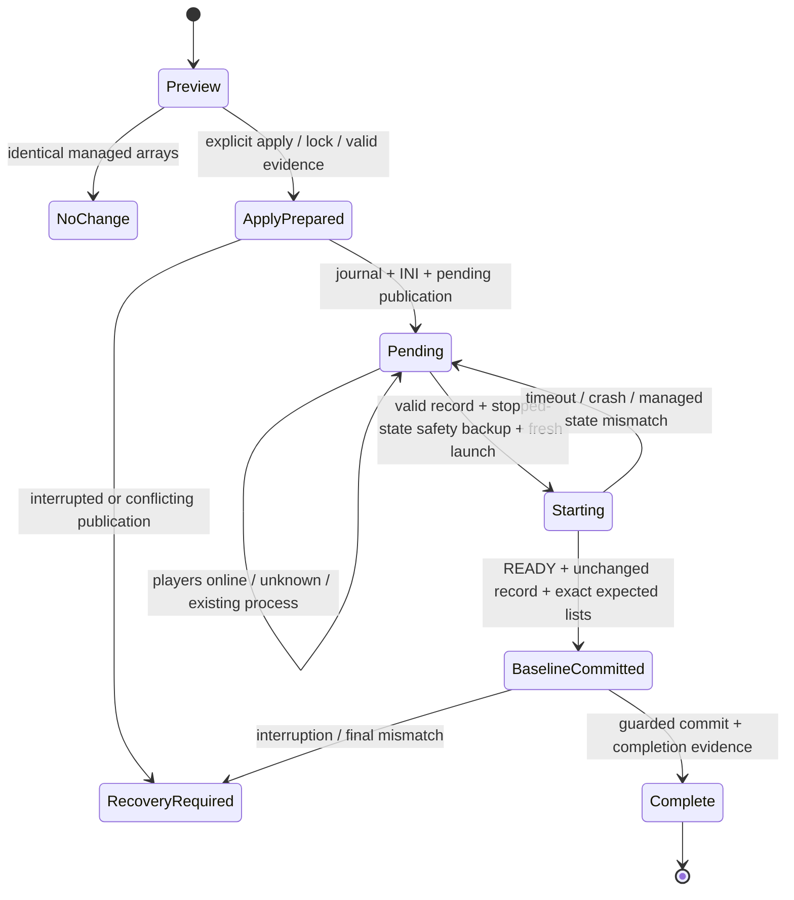

# Mod plan and configuration lifecycle

Status: verified source behavior plus proposed portable design, 2026-10-02. No implementation or plan application has been performed. Source authority: `Apply-PZModPlan.ps1`, `PZ-State.ps1`, `Config-State-PZ.ps1`, `Manage-PZ.ps1`, `Maintain-PZ.ps1`, and the copied config history.

## What already exists

The fingerprint bug described in the request is **already fixed in the current Windows source**. New records use SchemaVersion=2 and full Expected.WorkshopItems/Mods/Maps arrays. Validation checks the referenced plan's SHA256 and case-sensitive, order-sensitive arrays, rather than requiring the old whole-config hash after startup. ConfigHash and IniHash remain diagnostic. PZ can rewrite unrelated INI/Lua settings during startup; manager measures and commits the new baseline after a healthy fresh start.

The actual INI managed keys are WorkshopItems, Mods and **Map**. Maps is the JSON property. All are semicolon-separated ordered arrays. Source parser trims entries/omits empties, requires all keys, and rejects duplicates of a managed key. Current INI has 111 Workshop IDs, 137 Mod IDs and one map; future code derives these from the file rather than constants.

Plan shape: optional Description and array fields AddWorkshopItems, RemoveWorkshopItems, AddMods, RemoveMods, AddMaps, RemoveMaps. Unknown properties, scalar arrays, invalid IDs/separators and inconsistent anchors fail. Workshop IDs must be numeric strings. Mods/Maps additions may be strings or objects with Id and optional Before or After. Both anchors at once fail. Missing anchors fail. Remove runs before add; existing members retain order unless an anchored addition explicitly moves them. Unanchored existing additions are no-ops; new unanchored additions append. Duplicate results and empty map list fail. Optional Workshop variants are not selected automatically.

Source preview takes no operation lock and writes nothing. Apply takes the maintenance lock, reads original bytes/hash, computes a diff, and on real change writes history (original szs.ini plus read plan), rechecks INI hash, replaces INI atomically and publishes schema v2 pending. It preserves newline style but rewrites text as UTF-8 without BOM and adds a final newline; do not mistake that for general byte-preserving editing. If publishing pending throws after INI replacement, original bytes are restored. Process/host failure between writes is not a transaction and needs recovery. Multiple applies can overwrite pending with the latest explicit complete Expected state while retaining histories; Apply does not itself require the previous pending to be acknowledged.

Schema v2 source record includes RecordId, CreatedAt, Plan, PlanFile, PlanHash, Reason, ConfigHash, IniHash, Before/After counts, Expected arrays and History. Plan and History are Windows absolute paths. Existing process start leaves pending; only manager fresh-start acknowledgement may remove it. Update when previously stopped leaves pending. Restart/starting an offline pending state requires a safety backup; an ordinary successful stopped-state backup followed by a fresh start can also satisfy that prerequisite.

The snapshot contains no active pending. It does contain archived schema v1 metadata with counts 108 Workshop/134 Mods/1 Map -> 111/137/1, a matching reviewed plan, and matching pre-apply history path material. Archive filename says resolved; it is not evidence of an active restart or proof of how it was resolved.

## Source legacy compatibility

Source v1 fallback is stricter than additions/counts alone:

1. Require valid metadata, known schema, timestamp, plan file and PlanHash. V1 hashes decoded text re-encoded UTF-8; v2 hashes original file bytes.
2. Require each addition present and each removal absent in each current array, plus exact After counts.
3. Require saved pre-apply szs.ini and validate its Before counts.
4. Replay removals/additions/Before/After against that saved state and require **exact resulting membership and order** for WorkshopItems/Mods/Maps.
5. Fail if snapshot/plan is missing, references cannot be proven, counts conflict, anchors fail or reconstruction is ambiguous. The old whole ConfigHash is not the fallback guard.

Port this compatibility only through an explicit legacy-record importer/validator, since existing source supports v1 and archive material exists. A new runtime emits only v2. Legacy absolute Plan/History paths must be mapped to a confined imported copy using matching artifact hashes and provenance, never resolved against production C:\PZ or guessed by basename. The archived resolved record stays archived unless explicitly selected. Legacy failure retains record/evidence and inhibits automatic acknowledgement; it must not silently become 'none'.

## Proposed v2 authority and persistence

Keep the expected schema concept and exact arrays. Store an immutable copy of plan bytes under private ops state and use a confined project-relative reference, plus plan SHA256, record ID and before/after provenance. Copy source plan before applying to prevent a plan file edit during apply/start from changing authority. Diagnostic fingerprints never contain/print raw settings. Record comparison uses exact strings/case/order; no sorting or set equality.

Use an INI editor that finds only the exact managed keys, rejects duplicates/missing keys, preserves comments, unrelated bytes, BOM/newline/final-newline conventions, and does not use interpolation or treat semicolons as comments. Map filenames/IDs retain case. Strictness beyond the current permissive parser must be documented and tested; preview explains changed counts/order without returning passwords/full config.

Pending is durable runtime state, excluded from Git but included coherently in stopped-state recovery backups. Source JSON, immutable plan bytes, expected lists and pre-apply INI/history must stay together. No pending record is invented from config-state's generic 'workshop' change classification.

## Proposed state transitions

1. **Preview:** parse/validate plan and managed INI state; show exact additions/removals/order changes. No source mutation, lock/history/pending writes or downloads.
2. **Apply prepare:** under shared operation lock, inspect previous pending/journal, freeze plan bytes, capture original INI/history, and verify source hash/target identity. No changes for no-op. A malformed/unverifiable previous pending requires explicit recovery; a valid pending can be explicitly superseded by another reviewed apply with old record archived and superseded-by provenance. This preserves sequential explicit plans while improving traceability.
3. **Publish:** write an apply journal with original/expected hashes and pending identity; atomically replace INI and publish pending v2, then finalize journal. Atomic file operations plus journal allow restart recovery; they are not advertised as multi-file atomic transactions. Recovery recognizes unchanged original, fully applied expected, or conflicting state; no silent overwrite/launch in ambiguous cases. Fsync files/directories where supported and fault-test boundaries.
4. **Pending:** on-disk config is changed while old Java may still run. Status must say restart pending. Auto maintenance restarts only when desired=true, no operator maintenance/recovery block, player count known zero. Manager checks again under lock immediately before save/quit. Applying changes alone does not signal that mods were loaded.
5. **Fresh launch:** reject invalid pending before stopping. Record a new agent/Java generation and hold operation ownership through stop/backup/start. Require complete safety snapshot. Existing process READY cannot acknowledge pending. Offline app update remains offline. PZ startup may download Workshop; verify installed item evidence and startup diagnostics.
6. **Confirm:** after READY for that fresh generation, validate immutable plan hash, current pending record ID/fingerprint, exact current lists, and absence of superseding operation. Retry bounded config-read stabilization if PZ is still writing unrelated settings; unrelated rewrites do not invalidate the mod plan. Whole-config hash is computed now only for a guarded baseline commit.
7. **Complete:** internal acknowledgement writes post-start baseline/history with operation/generation/record IDs and a completion journal, then archives/removes active pending only after final record/managed-list stability check. Interrupted baseline-to-removal completion is reconciled from journal, not guessed from baseline hash. If anything cannot be proved, retain pending/recovery evidence and report the reason.

Readiness and matching lists prove that the fresh server accepted the intended state under the defined probes; they are not a full proof every mod feature works. Log review and client checks remain part of imported-world acceptance.

## Config-state versus pending

Source check uses whole direct INI/Lua file hashes and a separate Workshop/Mods-line hash; Maps affects only the generic config hash. Source commit refuses a pending record unless ExpectedConfigHash is provided. That is a race guard, not an access boundary: a manual caller could supply it. The portable design makes pending finalization an **internal lifecycle action**, never a public `commit --expected-hash` bypass.

Proposed behavior:

- `config-state check` reports missing baseline, general config drift, managed-list drift, active pending identity and reason. Include Map in the dedicated managed-list fingerprint; explicitly note this classification improvement.
- `config-state commit` acquires the operation lock and refuses any active pending/apply/recovery lifecycle, even if the caller provides a hash. It cannot delete/supersede pending. A manual nonpending commit records baseline only; it does not prove the running Java loaded arbitrary changed config.
- Only fresh-start acknowledgement can commit while pending. Internal authority is tied to the locked operation/generation, not possession of a SHA256 string.
- Linux baseline fingerprints use a defined ordinal filename ordering and active szs config inventory. Source fingerprints included test/old `.ini`/`.lua` files and Windows culture sorting; do not reuse those hashes as runtime baseline. Archive old files and baselines separately, document scope, and establish new baseline only after validated fresh start.
- Direct user edits that change managed arrays during pending fail validation. Unrelated edits do not invalidate expected arrays, but concurrent editing during final baseline publication must be detected/retried or refused safely.

## Required tests

Normal tests use small synthetic INI/JSON fixtures, not real credentials, snapshot worlds or live Steam:

| Area | Proof required |
| --- | --- |
| Parsing/editing | Ordered arrays, whitespace/empty entries, Map mapping, duplicate/missing keys, case, CRLF/LF/BOM/no final newline, all unrelated bytes preserved |
| Plan validation | Unknown fields/scalars/nonnumeric Workshop IDs/separators/invalid anchors/both anchors/empty map list fail without writes |
| List operations | Remove before add, all removals, append, Before/After/reposition, stable untouched order, duplicates and missing anchor failure |
| Preview/no-op | No history, pending, download or lifecycle mutation; no-op apply keeps previous valid pending |
| V2 validation | Correct exact arrays pass; reordered/same-count substitution/wrong case/missing expected/tampered plan/new record fail |
| Rewrite regression | Unrelated INI and sandbox rewrite at startup still allows pending completion; modified Mods/WorkshopItems/Map does not |
| V1 compatibility | Correct saved-state replay passes; additions/counts alone fail if order unproved; missing history/conflicting counts/legacy UTF-8 text hash/path relocation fail safely |
| Config-state | Maps drift classified as managed, public commit refused during pending, internal generation-bound commit cannot be forged with a hash |
| Lifecycle | Existing process never acknowledges; failed startup/RCON retains pending; offline update retains; connected/unknown players defer; fresh healthy start completes |
| Recovery | Fault injection at journal/INI/pending/baseline/remove boundaries; restore coherently preserves pending provenance; supersession audited |
| Confidentiality | Errors/preview/job/Discord/log output never return fixture secrets, credential fields or raw config |

Integration tests later use disposable Linux volumes and real Java starts to verify startup rewrite behavior, Workshop loading and state transitions. None were run in phase 1.
